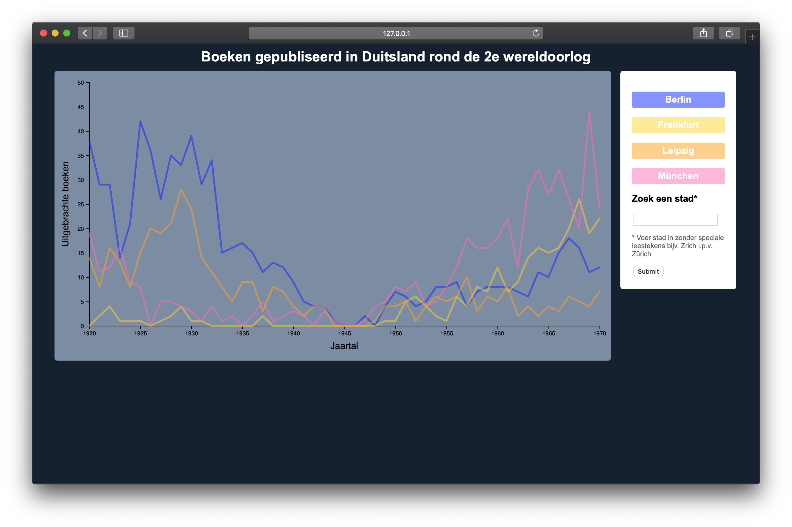
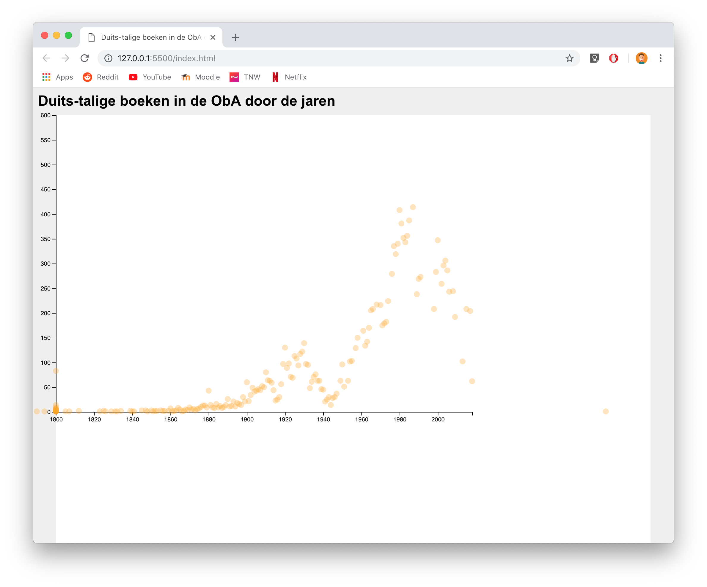

# Frontend-Data (FD)


## Index
* Introduction
* Installation
* Data Restructering 
* Checklist
* Conclusion
* Credits

## Introduction
The assignment for FD was to create a interactive data visualisation in which user could explore for themselves. The data was provided by the Amsterdam library (OBA). I created a multiline graph that showes german books published between 1930-1970 by city. The default graph showcases the 4 biggest cities by publisher. The user can add other cities themselves. 

## Installation
Request a key from OBA
```
Clone the repo:

git clone https://github.com/sjerrietukkel/frondend-data

Install OBA-scraper:
npm i @gijslaarman/oba-scraper

Create .env file for storing API key:
touch .env

paste the APIkey in the .env file:
PUBLIC_KEY=your_API_key

Start up the nodeJS server:
node index
```

## Data Restructering
This was what I spend the majority of the two weeks on. The example I based my graph on (https://beta.observablehq.com/@mbostock/d3-multi-line-chart) used the following structure: 
```js
[
    {
        y: "%Unemployed"
        series: {name:"Bethesda-Rockville-Frederick MD"
        values: ["2.4", "2.6", 'etc']
        }
        dates: [2000-01-01, 2001-02-02, 'etc']
    }
]
```
So to me it seemed logical to restructure it the same way, which horribly failed, because the example uses 2 seperate datasets which are combined and I used only one.

I wanted to restructure the data as city > pubYear > value. 
First I had to filter out all the typo's and invalid cities

```js
var publicationCity = data.map(d => {
        return {
            pubYear: d.pubYear,
            publication: d.publication == null ? 'geen plaats' : d.publication.replace(/[^a-zA-Z ]/g, "")
        }
    })
```
The following code counts checks publication years, how often a city is mentioned and checks the value.

```js

function createDataList(list){
    const result = [];
        list.forEach(city => {
            thisCityValues = {
                city: city,
                value: []
            }
            for (let i = 1920; i <= 1970; i++) {
                let thisYear = {
                    year: i,
                    value: 0
                }
            publicationCity.forEach(book => {
                if(book.publication != city) {
                            return
                        }
                        if (Number(book.pubYear) === i) {
                            thisYear.value++
                        }
                    })
                    thisCityValues.value.push(thisYear)
                }
            result.push(thisCityValues)
        })
    return result
}

```
With the help of @gijslaarman 

### Wireframes




### Credits
@Gijslaarman for helping me restructure the data. <br>
@Folkert-Jan for helping with the update function.